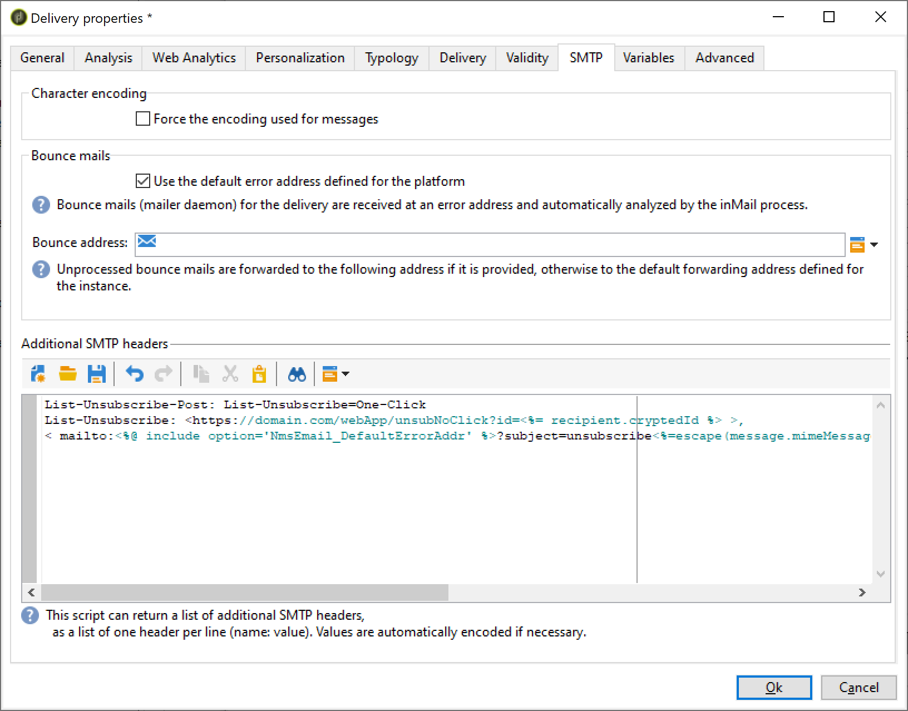
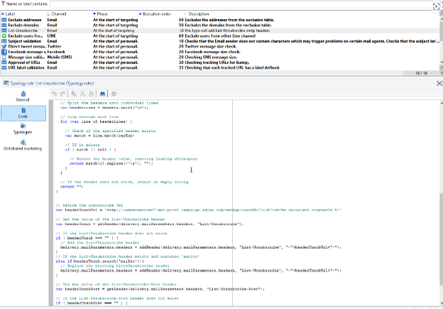
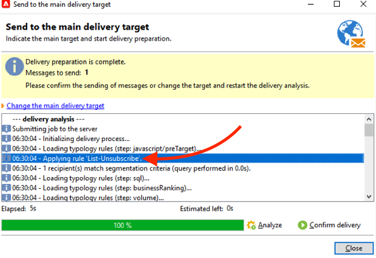

# Campaign Classic - 技术建议 {#technical-recommendations}

下面列出了在使用Adobe Campaign Classic时可用于提高可投放性的几种技术、配置和工具。

## 配置 {#configuration}

### 反向DNS {#reverse-dns}

Adobe Campaign检查是否为IP地址提供了反向DNS，并且这正确指向IP。

网络配置的重要一点是，确保为传出消息的每个IP地址定义正确的反向DNS。 这意味着对于给定的IP地址，存在反向DNS记录（PTR记录），具有循环回初始IP地址的匹配DNS（A记录）。

反向DNS的域选择在处理某些ISP时会产生影响。 特别是，AOL只接受与反向DNS具有相同域中的地址的反馈循环（请参阅[反馈循环](#feedback-loop)）。

>[!NOTE]
>
>您可以使用[此外部工具](https://mxtoolbox.com/SuperTool.aspx)来验证域的配置。

### MX规则 {#mx-rules}

MX规则（邮件交换器）是管理发送服务器和接收服务器之间通信的规则。

更准确地说，它们用于控制Adobe Campaign MTA（消息传输代理）向每个单独的电子邮件域或ISP(例如，hotmail.com、comcast.net)发送电子邮件的速度。 这些规则通常基于ISP发布的限制（例如，每个SMTP连接不超过20条消息）。

>[!NOTE]
>
>有关Adobe Campaign Classic中MX管理的详细信息，请参阅[此部分](https://experienceleague.adobe.com/docs/campaign-classic/using/installing-campaign-classic/additional-configurations/email-deliverability.html#mx-configuration)。

### TLS {#tls}

TLS（传输层安全性）是一种加密协议，可用于保护两个电子邮件服务器之间的连接，并保护电子邮件内容不被目标收件人以外的任何人读取。

### 发件人域 {#sender-domain}

要定义用于HELO命令的域，请编辑实例的配置文件(conf/config-instance.xml)并定义“localDomain”属性，如下所示：

```
<serverConf>
  <shared>
    <dnsConfig localDomain="mydomain.net"/>
  </shared>
</serverConf>
```

MAIL FROM域是技术退回邮件中使用的域。 此地址是在部署向导中或通过NmsEmail_DefaultErrorAddr选项定义的。

### SPF记录 {#dns-configuration}

SPF记录目前可在DNS服务器上定义为TXT类型记录（代码16）或SPF类型记录（代码99）。 SPF记录采用字符串形式。 例如：

```
v=spf1 ip4:12.34.56.78/32 ip4:12.34.56.79/32 ~all
```

将两个IP地址12.34.56.78和12.34.56.79定义为有权发送域的电子邮件。 **~all**&#x200B;表示任何其他地址都应解释为SoftFail。

用于定义SPF记录的Recommendations：

* 在末尾添加&#x200B;**~all** (SoftFail)或&#x200B;**-all** (Fail)以拒绝除已定义服务器以外的所有服务器。 如果没有这些信息，服务器将能够伪造此域（使用中性评估）。
* 请勿添加&#x200B;**ptr**(openspf.org建议不要添加，因为这样做成本高昂且不可靠)。

>[!NOTE]
>
>在[本节](/help/additional-resources/authentication.md#spf)中了解有关SPF的更多信息。

## 身份验证

>[!NOTE]
>
>在[本节](/help/additional-resources/authentication.md)中了解关于不同形式的电子邮件身份验证的更多信息。

### DKIM {#dkim-acc}

>[!NOTE]
>
>对于托管或混合安装，如果您已升级到[Enhanced MTA](https://experienceleague.adobe.com/docs/campaign-classic/using/sending-messages/sending-emails/sending-an-email/sending-with-enhanced-mta.html#sending-messages)，则Enhanced MTA将为所有域的所有邮件完成DKIM电子邮件身份验证签名。

在Adobe Campaign Classic中使用[DKIM](/help/additional-resources/authentication.md#dkim)需要以下先决条件：

**Adobe Campaign选项声明**：在Adobe Campaign中，DKIM私钥基于DKIM选择器和域。 当前无法为使用不同选择器的同一域/子域创建多个私钥。 无法定义哪个selector域/子域必须用于平台或电子邮件中的身份验证。 平台可以选择其中一个私钥，这意味着身份验证失败的可能性很高。

* 如果您已经为Adobe Campaign实例配置了DomainKeys，则只需在[域管理规则](https://experienceleague.adobe.com/docs/campaign-classic/using/sending-messages/monitoring-deliveries/understanding-delivery-failures.html#email-management-rules)中选择&#x200B;**dkim**&#x200B;即可。 如果没有，请执行与DomainKeys（取代DKIM）相同的配置步骤（私钥/公钥）。
* 由于DKIM是DomainKeys的改进版本，因此不必为同一域同时启用DomainKeys和DKIM。
* 以下域当前验证DKIM：AOL、Gmail。

## 反馈环 {#feedback-loop-acc}

反馈循环的工作方式是在ISP级别声明用于发送消息的一系列IP地址的给定电子邮件地址。 ISP会以类似于退回邮件的方式，将收件人报告为垃圾邮件的邮件发送到此邮箱。 该平台应配置为阻止将来向投诉用户投放内容。 即使他们没有使用正确的选择退出链接，也不要再与他们联系，这一点很重要。 基于这些投诉，ISP会将IP地址添加到其IP阻止列表。 根据ISP的不同，约1%的投诉率将导致阻止IP地址。

当前正在制定一个标准来定义反馈循环消息的格式： [滥用反馈报告格式(ARF)](https://tools.ietf.org/html/rfc6650)。

为实例实施反馈循环需要：

* 专用于实例的邮箱，可能是退回邮箱
* 专用于实例的IP发送地址

在Adobe Campaign中实施简单的反馈循环时，会使用退回消息功能。 反馈循环邮箱用作退回邮箱，并定义规则以检测这些邮件。 将报告邮件为垃圾邮件的收件人的电子邮件地址添加到隔离列表。

* 在&#x200B;**[!UICONTROL Administration > Campaign Management > Non deliverables Management > Mail rule sets]**&#x200B;中创建或修改退回邮件规则&#x200B;**Feedback_loop**，原因为&#x200B;**已拒绝**，类型为&#x200B;**Hard**。
* 如果已专门为反馈循环定义了邮箱，请通过在&#x200B;**[!UICONTROL Administration > Platform > External accounts]**&#x200B;中新建外部退回邮件帐户来定义用于访问邮箱的参数。

该机制可立即运作，以处理投诉通知。 为确保此规则正常工作，您可以暂时停用帐户以便它们不收集这些邮件，然后手动检查反馈循环邮箱的内容。 在服务器上，执行以下命令：

```
nlserver stop inMail@instance,
nlserver inMail -instance:instance -verbose.
```

如果强制为多个实例使用一个反馈循环地址，则必须：

* 复制在任意数量的邮箱上接收的邮件，
* 让每个邮箱被一个实例接收，
* 配置实例，使其仅处理与其相关的消息：实例信息包含在Adobe Campaign发送的消息的消息ID标头中，因此也位于反馈循环消息中。 只需在实例配置文件中指定&#x200B;**checkInstanceName**&#x200B;参数（默认情况下，实例未经验证，这可能导致某些地址被错误隔离）：

  ```
  <serverConf>
    <inMail checkInstanceName="true"/>
  </serverConf>
  ```

Adobe Campaign的可投放性服务管理您对以下ISP的反馈循环服务的订购：AOL、BlueTie、Comcast、Cox、EarthLink、FastMail、Gmail、Hotmail、HostedEmail、Libero、Mail.ru、MailTrust、OpenSRS、QQ、RoadRunner、Synacor、Telenor、Terra、UnitedOnline、USA、XS4ALL、Yayahoo、Yandex、Zoho。

## 列表 — 取消订阅 {#list-unsubscribe}

必须添加名为&#x200B;**List-Unsubscribe**&#x200B;的SMTP标头，以确保实现最佳可投放性管理。

此标头可用作“报告为垃圾邮件”图标的替代方法。 它在ISP的电子邮件界面中显示为“取消订阅”链接。

使用此功能可降低投诉率并有助于保护您的声誉。 反馈将作为取消订阅执行。

Gmail， Outlook.com， Yahoo！ 和Microsoft Outlook支持此方法。 可直接在其界面中找到“取消订阅”链接。 例如：


>[!NOTE]
>
>“取消订阅”链接可能不会始终显示。 事实上，它可以取决于每个ISP的具体标准和政策。 因此，请确保您的邮件由发件人发送：
>
>* 名声很好
>* 在ISP的垃圾邮件投诉阈值下
>* 已通过完全身份验证

存在两个版本的List-Unsubscribe标头功能：

* **&quot;mailto&quot; List-Unsubscribe** — 使用此方法，单击&#x200B;**取消订阅**&#x200B;链接会将预填充的电子邮件发送到电子邮件标头中指定的取消订阅地址。 [了解详情](#mailto-list-unsubscribe)

* **&quot;One-Click&quot; List-Unsubscribe** — 使用此方法，单击&#x200B;**Unsubscribe**&#x200B;链接将直接取消订阅用户。 [了解详情](#one-click-list-unsubscribe)

>[!NOTE]
>
>从2024年6月1日开始，主要ISP将要求发件人遵守&#x200B;**一键式列表取消订阅**。

### “mailto”列表 — 取消订阅 {#mailto-list-unsubscribe}

使用此方法时，单击&#x200B;**取消订阅**&#x200B;链接会将预填充的电子邮件发送到电子邮件标头中指定的取消订阅地址。

要使用“mailto”列表取消订阅，必须输入命令行，在其中指定电子邮件地址，例如： `List-Unsubscribe: <mailto:client@newsletter.example.com?subject=unsubscribe?body=unsubscribe>`

>[!CAUTION]
>
>以上示例基于收件人表。 如果数据库实施是从另一个表中完成的，请确保用正确的信息重写命令行。

您还可以使用命令行创建动态“mailto”List-Unsubscribe，例如： `List-Unsubscribe: <mailto:<%=errorAddress%>?subject=unsubscribe%=message.mimeMessageId%>`

要在Campaign中实施&#x200B;**&quot;mailto&quot; List-Unsubscribe**，您可以：

* 直接在投放或投放模板中添加命令行 — [了解如何操作](#adding-a-command-line-in-a-delivery-template)

* 创建分类规则 — [了解如何操作](#creating-a-typology-rule)

#### 在投放或模板中添加命令行 {#adding-a-command-line-in-a-delivery-template}

必须将命令行添加到电子邮件的SMTP标头的&#x200B;**[!UICONTROL Additional SMTP headers]**&#x200B;部分中。

可以在每个电子邮件或现有投放模板中完成此添加。 您还可以创建包含此功能的新投放模板。

例如，在&#x200B;**[!UICONTROL Additional SMTP headers]**&#x200B;字段中输入以下脚本： `List-Unsubscribe: mailto:unsubscribe@domain.com`。 单击&#x200B;**取消订阅**&#x200B;链接会向unsubscribe@domain.com地址发送电子邮件。

您也可以使用动态地址。 例如，若要向为平台定义的错误地址发送电子邮件，您可以使用以下脚本： `List-Unsubscribe: <mailto:<%=errorAddress%>?subject=unsubscribe%=message.mimeMessageId%>`


#### 创建分类规则 {#creating-a-typology-rule}

规则必须包含生成命令行的脚本，并且必须包含在电子邮件标头中。

在[本节](https://experienceleague.adobe.com/docs/campaign-classic/using/orchestrating-campaigns/campaign-optimization/about-campaign-typologies.html#typology-rules)中了解如何在Adobe Campaign v7/v8中创建分类规则。

>[!NOTE]
>
>我们建议创建分类规则：使用此分类规则时，会自动将List-Unsubscribe功能添加到每封电子邮件中。

### 一键式列表取消订阅 {#one-click-list-unsubscribe}

使用此方法，单击&#x200B;**取消订阅**&#x200B;链接将直接取消订阅用户，只需一个操作即可取消订阅。

从2024年6月1日开始，主要ISP将要求发件人遵守&#x200B;**一键式列表取消订阅**。

为符合此要求，发件人必须：

* 添加以下命令行： `List-Unsubscribe-Post: List-Unsubscribe=One-Click`。
* 包括URI取消订阅链接。
* 支持从接收器接收HTTPPOST响应，Adobe Campaign支持此功能。 您也可以使用外部服务。

要直接在Adobe Campaign v7/v8中支持“一键式列表 — 取消订阅”POST响应，您必须在“取消订阅收件人：一键式取消订阅”Web应用程序中添加。 为实现此操作，请执行以下步骤：

1. 转到&#x200B;**[!UICONTROL Resources]** > **[!UICONTROL Online]** > **[!UICONTROL Web applications]**。

1. 上传“取消订阅的收件人不点击”的[XML](/help/assets/WebAppUnsubNoClick.xml.zip)文件。

要在Campaign中配置&#x200B;**一键式List-Unsubscribe**，您可以：

* 在投放或投放模板中添加命令行 — [了解如何操作](#one-click-delivery-template)
* 创建分类规则 — [了解如何操作](#one-click-typology-rule)

#### 在投放或模板中配置一键式列表 — 取消订阅 {#one-click-delivery-template}

要在投放或投放模板中配置一键式List-Unsubscribe，请执行以下步骤。

1. 转到投放属性的&#x200B;**[!UICONTROL SMTP]**&#x200B;部分。

1. 在&#x200B;**[!UICONTROL Additional SMTP Headers]**&#x200B;下，输入命令行，如下例所示。 每个标题应位于单独的行中。

例如：

```
List-Unsubscribe-Post: List-Unsubscribe=One-Click
List-Unsubscribe: <https://domain.com/webApp/unsubNoClick?id=<%= recipient.cryptedId %> >, < mailto:<%@ include option='NmsEmail_DefaultErrorAddr' %>?subject=unsubscribe<%=escape(message.mimeMessageId) %> >
```



以上示例将为支持一键式服务的ISP启用“一键式列表 — 取消订阅”，同时确保不支持“mailto”的接收者仍然可以通过电子邮件请求取消订阅。

#### 创建分类规则以支持一键式列表取消订阅 {#one-click-typology-rule}

要使用分类规则配置One-Click List-Unsubscribe，请执行以下步骤。

1. 从导航树中，转到&#x200B;**[!UICONTROL Typolgy rules]**&#x200B;并单击&#x200B;**[!UICONTROL New]**。

   


1. 配置新的分类规则，例如：

   * **[!UICONTROL Rule type]**： **[!UICONTROL Control]**
   * **[!UICONTROL Phase]**： **[!UICONTROL At the start of targeting]**
   * **[!UICONTROL Channel]**： **[!UICONTROL Email]**
   * **[!UICONTROL Level]**：您的选择
   * **[!UICONTROL Active]**


   

1. 对分类规则的javascript进行编码，如以下示例所示。

   >[!NOTE]
   >
   >下面描述的代码仅作为示例引用。

   此示例详细说明了如何：
   * 配置“mailto”列表取消订阅。 它会添加标头或附加现有的“mailto：”参数，并将其替换为： &lt;mailto..>， https://...
   * 在一键式List-Unsubscribe标头中添加。 它使用`var headerUnsubUrl = "https://campmomentumv7-mkt-prod3.campaign.adobe.com/webApp/unsubNoClick?id=<%= recipient.cryptedId %>"÷`

   >[!NOTE]
   >
   >您可以添加其他参数（如&amp;service =...）。

   ```
   // Function to add or replace a header in the provided headers 
   function addHeader(headers, header, value)  { 
       
     // Create the new header line 
     var headerLine = header + ": " + value; 
       
     // Create a regular expression to find the specified header 
     var regExp = new RegExp(header + ":(.*)$", "i") 
       
     // Split the headers into individual lines 
     var headerLines = headers.split("\n"); 
       
     // Loop through each line 
     for (var i=0; i < headerLines.length; i++) { 
         
       // Check if the specified header exists 
       var match = headerLines[i].match(regExp) 
         
       // If it exists 
       if ( match != null ) { 
           
         // Replace the existing header line 
         headerLines[i] = headerLine; 
           
         // Return the modified headers 
         return headerLines.join("\n"); 
       } 
     } 
       
     // If the header does not exist, add the new header line 
     headerLines.push(headerLine); 
       
     // Return the modified headers 
     return headerLines.join("\n"); 
   } 
     
   // Function to get the value of a specified header from the provided headers 
   function getHeader(headers, header) { 
       
     // Create a regular expression to find the specified header 
     var regExp = new RegExp(header + ":(.*)$", "i") 
       
     // Split the headers into individual lines 
     var headerLines = headers.split("\n"); 
       
     // Loop each line 
     for each (line in headerLines) { 
         
       // Check if the specified header exists 
       var match = line.match(regExp); 
         
       // If it exists 
       if ( match != null ) { 
           
         // Return the header value, removing leading whitespace 
         return match[1].replace(/^\s*/, ""); 
       } 
     } 
       
     // If the header does not exist, return an empty string 
     return ""; 
   } 
     
     
   // Define the unsubscribe URL 
   var headerUnsubUrl = "https://campmomentumv7-mkt-prod3.campaign.adobe.com/webApp/unsubNoClick?id=<%= recipient.cryptedId %>"; 
     
   // Get the value of the List-Unsubscribe header 
   var headerUnsub = getHeader(delivery.mailParameters.headers, "List-Unsubscribe"); 
     
   // If the List-Unsubscribe header does not exist 
   if ( headerUnsub === "" ) { 
     // Add the List-Unsubscribe header 
     delivery.mailParameters.headers = addHeader(delivery.mailParameters.headers, "List-Unsubscribe", "<"+headerUnsubUrl+">"); 
   } 
   // If the List-Unsubscribe header exists and contains 'mailto' 
   else if(headerUnsub.search('mailto')){ 
     // Replace the existing List-Unsubscribe header 
     delivery.mailParameters.headers = addHeader(delivery.mailParameters.headers, "List-Unsubscribe", "<"+headerUnsubUrl+">"); 
   } 
     
   // Get the value of the List-Unsubscribe-Post header 
   var headerUnsubPost = getHeader(delivery.mailParameters.headers, "List-Unsubscribe-Post"); 
     
   // If the List-Unsubscribe-Post header does not exist 
   if ( headerUnsubPost === "" ) { 
     // Add the List-Unsubscribe-Post header 
     delivery.mailParameters.headers = addHeader(delivery.mailParameters.headers, "List-Unsubscribe-Post", "List-Unsubscribe=One-Click"); 
   } 
     
   // Return true to indicate success 
   return true; 
   ```


   

1. 将新规则添加到应用于电子邮件的分类。

   >[!NOTE]
   >
   >您可以将其添加到默认分类。

   

1. 准备新投放。

   >[!CAUTION]
   >
   >验证投放属性中的&#x200B;**[!UICONTROL Additional SMTP headers]**&#x200B;字段是否为空。

   

1. 在投放准备期间检查是否应用新的分类规则。

   

1. 验证取消订阅链接是否存在。

   

## 电子邮件优化 {#email-optimization}

### SMTP {#smtp}

SMTP（简单邮件传输协议）是用于电子邮件传输的Internet标准。

规则未检查的SMTP错误列在&#x200B;**[!UICONTROL Administration]** > **[!UICONTROL Campaign Management]** > **[!UICONTROL Non deliverables Management]** > **[!UICONTROL Delivery log qualification]**&#x200B;文件夹中。 默认情况下，这些错误消息被解释为无法访问软错误。

如果您希望正确地限定来自SMTP服务器的反馈，则必须确定最常见的错误，并在&#x200B;**[!UICONTROL Administration]** > **[!UICONTROL Campaign Management]** > **[!UICONTROL Non deliverables Management]** > **[!UICONTROL Mail rule sets]**&#x200B;中添加相应的规则。 如果没有此操作，平台将执行不必要的重试（对于未知用户），或者在执行给定数量的测试后错误地隔离某些收件人。

### 专用IP {#dedicated-ips}

Adobe为每位客户提供专用的IP策略，并增加IP，以建立信誉并优化投放性能。
