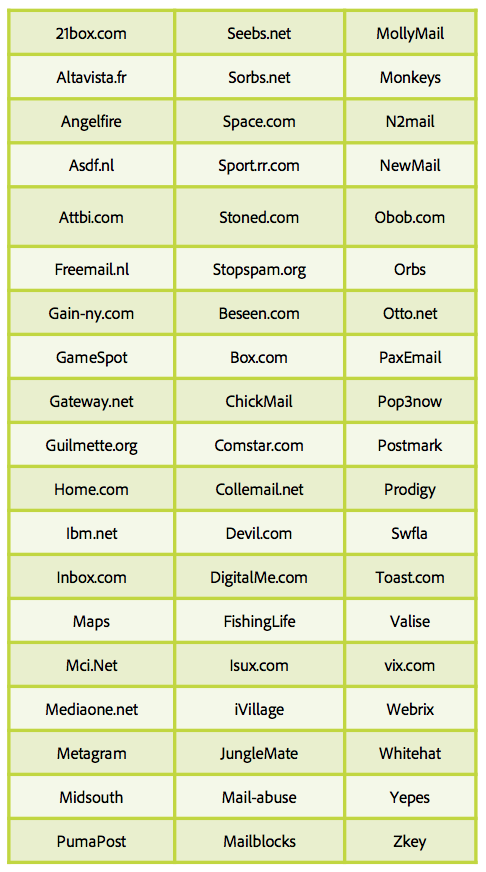

# 关于垃圾邮件陷阱

[垃圾邮件陷阱](/help/metrics/spam-traps.md)是有效的地址，在向发送电子邮件时没有错误消息。 垃圾邮件陷阱的主要任务是：识别没有数据卫生流程的垃圾邮件发送者或发送者。

## 谁管理这些垃圾邮件陷阱地址？

第一类垃圾邮件陷阱地址是IP和域阻止列表公司，如SpamHaus、Sorbs、SpamCop。 这些公司拥有庞大的地址网络，这些地址在各种互联网页面（如网站、博客、论坛）上发送，这样垃圾邮件发送者就可以收集他们的地址。

第二类垃圾邮件陷阱基于旧的活动ISP地址。 这些ISP拥有自己的垃圾邮件陷阱网络，该网络构建在陷阱中重新转换的非活动地址上，并且每次点击都会影响发送者IP和域名信誉。

## 它是如何工作的？

**没有最终用户的电子邮件地址**:这些地址没有，并且将永远没有能够注册新闻稿或任何其他类型通信的最终用户。

**用户放弃的电子邮件地址**:在一段时间不活动后，ISP会停用地址。退回邮件会发送给发件人，以告知他们此新状态。 发件人必须在隔离中推送这些地址，或从未来通信中删除这些地址。 ISP使用这些在“垃圾邮件陷阱”中转换的地址来监控发送者的不良行为。

## 如何识别或识别垃圾邮件陷阱？

识别垃圾邮件陷阱是一项困难的工作，这些地址必须保持匿名，因为它们被用于识别错误发件人。 大多数ISP没有打开并单击系统来监视错误的发送者点击。 根据先前的定义，可以确定可疑地址的盒并测试盒选择的效率。

## 为什么您的数据库被垃圾邮件陷阱感染？

您的电子邮件地址数据库包含垃圾邮件陷阱，怎么可能？ 两大原因是数据库卫生过程缺乏或收集功能失调。

以下几点可帮助您检查您的流程：

* 功能障碍：
   * 您的电子邮件地址来自何处？ 使用多少个源来收集这些地址？ 你能认出他们吗？ 内部/共同注册？
   * 您的选择加入系统是否工作正常？
   * 您是否检查了地址的域和别名？ 用下面的桌子做！
* 数据库卫生过程：
   * 过去12个月中关于不活动地址的流程是什么？
   * 您是否将软退回的隔离处理为“不活动用户”？
   * 您上次处理数据库并尝试清理数据库的时间是什么时候？ 定期做。

## 要避免的别名和域

**别名**

**域**

