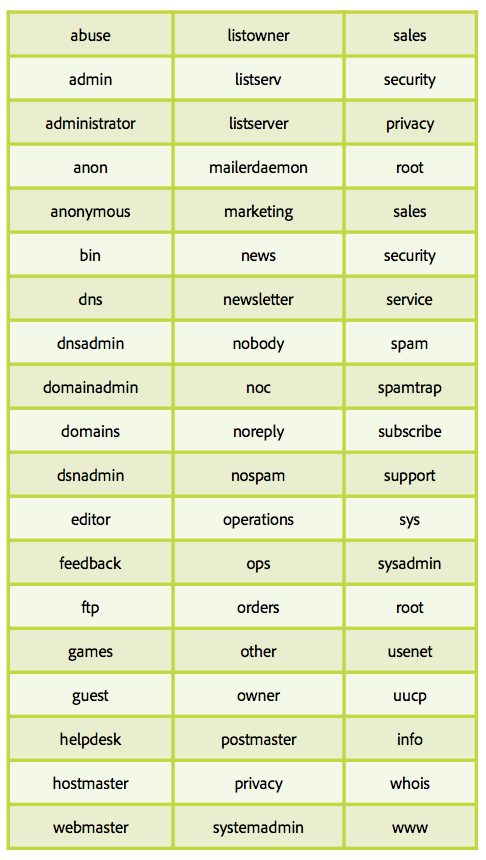
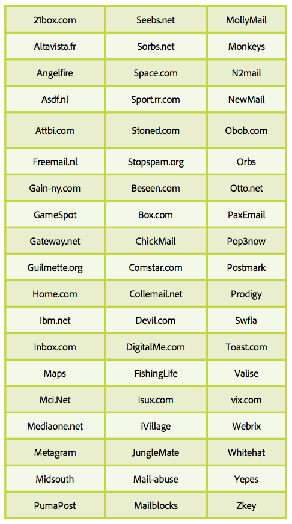

# 关于垃圾邮件陷阱

[垃圾邮件陷阱](/help/metrics/spam-traps.md)是有效的地址，在发送电子邮件时没有错误消息。 垃圾邮件陷阱的主要任务是：识别没有数据卫生流程的垃圾邮件发送者或发件人。

## 谁管理这些垃圾邮件陷阱地址？

第一类垃圾邮件陷阱地址是IP和域阻止列表公司，如SpamHaus、Sorbs、SpamCop。 这些公司拥有庞大的地址网络，这些地址被分发到网站、博客、论坛等各种Internet页面上，这样垃圾邮件发送者就可以收集他们的地址。

第二种类型的垃圾邮件陷阱基于旧的活动ISP地址。 这些ISP拥有自己的垃圾邮件陷阱网络，这些网络构建于在陷阱中重新转换的非活动地址上，并且每次点击都会影响发件人的IP和域信誉。

## 它是如何工作的？

**没有最终用户的电子邮件地址**：这些地址没有，也永远不会有最终用户可以注册新闻稿或任何其他类型的通信。

**用户放弃的电子邮件地址**：在一段时间不活动后，ISP将停用这些地址。 退回消息将发送给发件人，以告知他们此新状态。 发件人必须将这些地址加入隔离或从未来通信中删除这些地址。 ISP使用这些在“垃圾邮件陷阱”中转换的地址来监控有不良行为的发件人。

## 如何识别垃圾邮件陷阱？

识别垃圾邮件陷阱是一项困难的工作，这些地址必须保持匿名，因为它们用于识别恶意发件人。 大多数ISP没有打开和单击系统来监视发件人点击错误。 根据先前的定义，可以确定可疑地址的吊舱并测试吊舱选择的效率。

## 为什么您的数据库受到垃圾邮件陷阱的感染？

您的电子邮件地址数据库包含垃圾邮件陷阱，这怎么可能？ 两个主要原因是数据库卫生流程不足或收集功能障碍。

以下几点可帮助您检查流程：

* 收集功能障碍：
   * 您的电子邮件地址来自何处？ 有多少个来源用于收集这些地址？ 你能辨认出他们吗？ 内部/共同注册？
   * 您的选择加入系统是否正常工作？
   * 您是否检查了地址的域和别名？ 用下面的桌子来做！
* 数据库保健过程：
   * 您对于过去12个月内的非活动地址采用什么流程？
   * 您是否正在以“非活动用户”身份处理软退回的隔离？
   * 您上次管理数据库并尝试清理数据库是什么时候？ 定期做。

## 要避免的别名和域

**别名**

**域**

