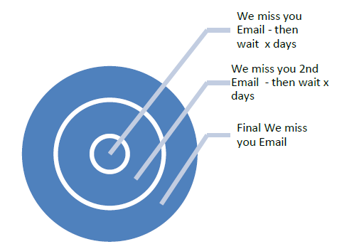

# 重新接触最佳实践 {#re-engagement}

在实施可投放性的同时，一些最佳实践包括尝试保持健康的订阅者基础，并通过重新参与（或回馈）策略提高可投放性。

* 维持健康的订阅者基础是确保良好和一致交付的主要方面之一。 许多可投放性问题源自糟糕的数据实践和维护。
* 营销人员目前面临的最常见问题之一是订阅者活动不活跃（也称为低参与或未参与），这可能会对电子邮件的投放和低ROI产生不利影响。

>[!NOTE]
>
>有关重新接触活动策略和Adobe可投放性服务的更多信息，请联系您的可投放性顾问，或与您的Adobe销售代理联系。

## ISP如何查看非参与活动？ {#how-do-isps-view-non-engagement-activity-}

多年来，ISP一直使用来自用户的参与反馈量度来确定报文的放置位置或是否应该投放。 用户[参与](/help/engagement.md)由正反馈和负反馈组成，ISP会定期监视。 没有参与也许是消极参与的主要原因之一。 从可交付性的角度来看，始终如一地向没有表现出参与度的用户发送营销活动也会降低IP地址和域的整体信誉。

Gmail、Microsoft®和OATH等ISP将非参与视为不需要的电子邮件，并开始将邮件重定向到垃圾邮件文件夹。 此外，这些订阅者可能不再拥有电子邮件帐户，这可用作“回收”垃圾邮件陷阱。 这意味着该地址在一段时间内无效，并且所有消息都被拒绝。 如果您的订阅者管理系统没有删除“硬退回”地址，则可能会邮寄给垃圾邮件陷阱，这可能导致严重的投放问题。

## 您应如何进入非活动状态？ {#how-should-you-approach-inactivity-}

使用Adobe平台的客户可以通过查看打开的并根据区段单击数据来查看其实例中的非活动状态。 由于不参与可能会阻碍投放，因此首先要考虑的可能是从数据库中删除订阅者。 不过，有时候，这可能被证明是一个错误的选择。 因此，重新参与（也称为回合）策略是保留对接收邮件感兴趣的订阅者，并逐步淘汰不再显示活动的订阅者的最佳建议。

## 重新参与活动是否真的有效？ {#do-re-engagement-campaigns-really-work-}

根据Return Path研究，重新参与活动的开放率为12%，而正常活动的平均开放率为14%。 尽管只有24%的订阅者阅读了重新接触营销活动，但其中约45%阅读了后续消息。

## 如何创建重新参与活动？ {#how-do-you-create-a-re-engagement-campaign-}

### 阶段1 {#phase-1}

* 第一步是识别很少或没有打开或单击活动的订阅者，并根据设置的时间范围相应地划分此组。 经验法则是审查过去90天内未打开或单击电子邮件的订阅者。 但是，根据业务的性质（例如，季节性派遣），这种需求会有所不同。
* 在定义时间范围时要牢记的另一点是， ISP和阻止列表公司认为参与时间介于1.5到1.8年之间。 此外，行为活动（如购买和网站活动）或其他接触点（如注册阶段或首次联系时的偏好设置）。

### 阶段2 {#phase-2}

* 定义区段后，下一步是创建根据已识别的量度迎合订阅者的重新参与营销活动。 创建主题行有助于提高订阅者的兴趣。 根据一项“回访路径”研究，显示“我们很想你”的主题行和内容产生的响应率高于“我们希望你回来”。
* 还可以提供重新参与电子邮件的奖励。 在考虑带折扣的优惠时，最好使用美元金额与百分比。 Return Path还建议这样做，因为它将产生更高的响应率。 最后，执行A/B拆分测试以查看响应率和成功率也是一个有用的选项。

### 阶段3 {#phase-3}

下一步是确定重新参与活动的频率。 与重新确认消息不同，重新参与活动旨在随着时间的推移，通过一系列电子邮件赢回订阅者。 以下示例提供了频率的示例。

通过遵循打开或单击活动参与营销活动的订阅者，将添加回参与订阅者列表。

### 阶段4 {#phase-4}

* 下一阶段是识别那些持续不显示任何活动的订阅者，并在一段时间内逐渐减少向其发送电子邮件。 如果过去一年内没有活动，最好暂停订阅者的电子邮件订阅。 尽管他们对电子邮件内容不感兴趣，但总是有最后一次机会，让他们通过发送一次性重新确认营销活动来重新激活订阅。
* 重新确认营销活动是一种询问长时间不活动的订阅者是否想要保留在订阅列表中的好方法。 在创建营销活动时，最好添加“单击此处”链接，以便他们可以确认操作并验证其地址。 这样，该操作便可以记录在数据库中。 再确认电子邮件的示例如下：

  

  一旦订阅者执行了操作，即可提供确认其重新订阅的登陆页面。 以下是登陆页面的示例：

  

## 产品特定资源

**Adobe Campaign**

* [Campaign Classic中的跟踪日志](https://experienceleague.adobe.com/docs/campaign-classic/using/sending-messages/monitoring-deliveries/delivery-dashboard.html#tracking-logs)
* [Campaign Standard中的跟踪日志](https://experienceleague.adobe.com/docs/campaign-standard/using/testing-and-sending/sending-and-tracking-messages/tracking-messages.html#tracking-logs)

**Adobe客户历程管理**

* [邮件跟踪](https://experienceleague.adobe.com/docs/journey-optimizer/using/reporting/message-tracking.html?lang=zh-Hans)
