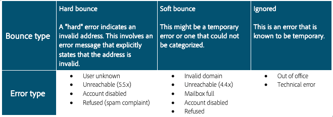

# 跳出次数

退回是投放尝试和失败的结果，在此情况下 ISP 会提供回失败通知。 退回处理是列表安全机制的关键部分。 在给定的电子邮件已连续多次退回后，此过程会将其标记以进行抑制。 触发抑制所需的退回次数和类型根据系统而异。 此过程会阻止系统继续发送无效的电子邮件地址。 退回是 ISP 用于确定 IP 信誉的关键数据之一。 关注该指标非常重要。 “已投放”与“已退回”可能是衡量营销消息投放的最常见方式：投放百分比越高越好。

我们将研究两种不同的退回。

## 硬弹回

硬退回是在 ISP 将对用户地址的邮寄尝试确定为不可投放后生成的永久失败。 在 Adobe Campaign 中，分类为不可投放的硬退回会添加到隔离，这意味着不会重新尝试这些邮寄。 在某些情况下，如果失败的原因未知，则会忽略硬退回。
以下是硬退回的一些常见示例：

* 地址不存在
* 帐户已禁用
* 语法错误
* 域错误

## 软退回

软退回是 ISP 在难以送达邮件时生成的临时失败。 软失败将多次重试（根据使用自定义还是现成投放设置而异），以便尝试成功投放。 在尝试最大数量的重试之前，不会将持续软退回的地址添加到隔离（这同样根据设置而异）。 软退回的一些常见原因包括：

* 邮箱已满
* 接收电子邮件的服务器停机
* 发件人信誉问题

>[!NOTE]
>
>退回是信誉问题的一项关键指标，因为它们可以凸显坏数据源（硬退回）或 ISP 信誉问题（软退回）。
>
>软退回通常发生在发送电子邮件的过程中，应当允许在重试处理期间解决软退回问题，然后再将其描述为真正的可投放性问题。 如果您的软退回率超过单个 ISP 的 30% 且未在 24 小时内解决，则最好向您的 Adobe Campaign 可投放性顾问提出疑虑。

## 产品特定资源

**Adobe Campaign Classic**

* [投放失败类型和原因](https://experienceleague.adobe.com/docs/campaign-classic/using/sending-messages/monitoring-deliveries/understanding-delivery-failures.html?lang=zh-Hans#delivery-failure-types-and-reasons)
* [退回邮件管理](https://experienceleague.adobe.com/docs/campaign-classic/using/sending-messages/monitoring-deliveries/understanding-delivery-failures.html?lang=zh-Hans#bounce-mail-management)
* [投放失败和退回报告](https://experienceleague.adobe.com/docs/campaign-classic/using/reporting/reports-on-deliveries/global-reports.html?lang=zh-Hans#non-deliverables-and-bounces)

**Adobe Campaign Standard**

* [投放失败类型和原因](https://experienceleague.adobe.com/docs/campaign-standard/using/testing-and-sending/monitoring-messages/understanding-delivery-failures.html?lang=zh-Hans#delivery-failure-types-and-reasons)
* [退回邮件鉴定](https://experienceleague.adobe.com/docs/campaign-standard/using/testing-and-sending/monitoring-messages/understanding-delivery-failures.html?lang=zh-Hans#bounce-mail-qualification)
* [退回摘要报告](https://experienceleague.adobe.com/docs/campaign-standard/using/reporting/list-of-reports/bounce-summary.html?lang=zh-Hans#reporting)
