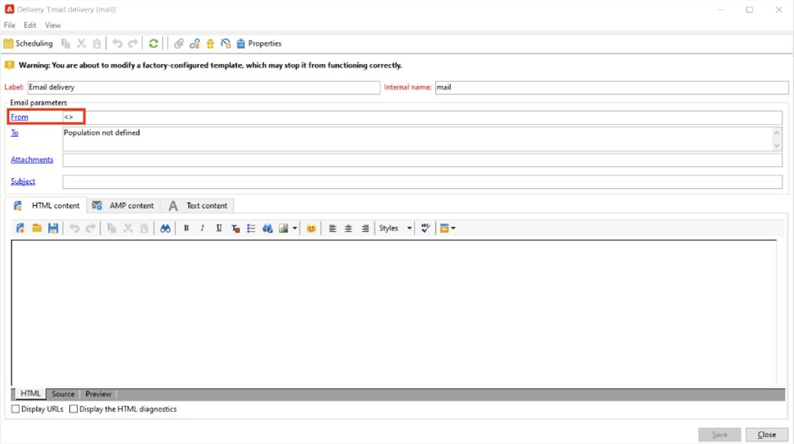

# 实施 [!DNL Domain-based Message Authentication, Reporting and Conformance] (DMARC)

本文的目的是为读者进一步提供电子邮件认证方法DMARC的信息。 通过解释DMARC的工作方式及其各种政策选项，读者将更好地了解DMARC对电子邮件可投放性的影响。

## 什么是DMARC？ {#about}

基于域的消息身份验证、报告和符合是一种电子邮件身份验证方法，它允许域所有者保护其域免遭未经授权的使用。 DMARC还提供了电子邮件身份验证状态的反馈，并允许发件人控制身份验证失败的电子邮件会发生什么情况。 这包括监视、隔离或拒绝邮件的选项，具体取决于已实施的DMARC策略。

DMARC有三个政策选项：

* **监视器(p=none)：** 指示邮箱提供商/ISP对邮件执行正常操作。
* **隔离(p=quarantine)：** 指示邮箱提供商/ISP传送未将DMARC传递到收件人的垃圾邮件或垃圾邮件文件夹的邮件。
* **拒绝（p=拒绝）：** 指示邮箱提供商/ISP阻止未通过DMARC导致退回的邮件。

## DMARC的工作原理 {#how}

SPF和DKIM均用于将电子邮件与域相关联，并共同验证电子邮件。 DMARC更进一步，通过匹配DKIM和SPF检查的域，帮助防止欺骗。 要传递DMARC，必须传递SPF或DKIM。 如果这两种身份验证都失败，DMARC将失败，并且电子邮件将根据您选择的DMARC策略进行投放。

>[!NOTE]
>
>DMARC要求在“发件人”和“返回路径”地址之间保持一致。

## 为什么要实施DMARC？ {#why}

DMARC是可选的，尽管它不是必需的，但是它是免费的，允许电子邮件接收者轻松识别电子邮件的身份验证，这可能会改善投放。 DMARC的主要优势之一是，它可以报告哪些报文未通过SPF和/或DKIM。 它还可以使发件人在一定程度上控制未通过上述任一身份验证方法的邮件所发生的情况。 通过DMARC报告，发件人可以看到哪些消息未通过DMARC，从而能够采取措施来减少进一步的错误。

>[!NOTE]
>
>如果要实施BIMI，则需要p=quarantine或p=reject DMARC策略。

## 实施DMARC的最佳实践 {#best-practice}

由于DMARC是可选的，因此默认情况下，在任何ESP平台上都不会对其进行配置。 必须在DNS中为您的域创建DMARC记录才能使其正常工作。 此外，需要您选择的电子邮件地址来指示DMARC报告应在组织内的什么位置。 作为最佳实践，建议您逐步推出 DMARC 实施，方法是将 DMARC 策略从 p=none 提升到 p=quarantine，再提升到 p=reject，以便让您了解 DMARC 的潜在影响。

1. 分析您收到并使用的反馈(p=none)，这告知接收者不对身份验证失败的邮件执行任何操作，但仍会向发件人发送电子邮件报告。 此外，如果合法邮件未通过身份验证，则查看和修复 SPF/DKIM 的问题。
1. 确定SPF和DKIM是否一致并通过所有合法电子邮件的身份验证，然后将策略移至(p=quarantine)，这会告知接收电子邮件服务器隔离身份验证失败的电子邮件（这通常意味着将这些邮件放入垃圾邮件文件夹）。
1. 将策略调整为（p=拒绝）。 p= reject 策略告知接收者完全拒绝（退回）验证失败的域的所有电子邮件。 启用此策略后，只有经域验证为 100% 经过身份验证的电子邮件才有机会进入收件箱。

   >[!NOTE]
   >
   >请谨慎使用此策略，并确定它是否适合您的组织。

## DMARC报告 {#reporting}

DMARC提供接收有关SPF/DKIM失败的电子邮件的报告的功能。 在身份验证过程中，ISP服务生成了两个不同的报告，发件人可以通过其DMARC策略中的RUA/RUF标记接收这些报告：

* **汇总报表(RUA)：** 不包含任何对GDPR敏感的PII（个人身份信息）。
* **法医报告（联阵）：** 包含对GDPR敏感的电子邮件地址。 在使用之前，最好在内部检查如何处理需要符合GDPR的信息。

这些报告的主要用途是接收尝试欺骗的电子邮件概述。 这些是技术含量很高的报告，最好通过第三方工具消化。 一些专门DMARC监控的公司包括：

* [ValiMail](https://www.valimail.com/products/#automated-delivery)
* [阿加里语](https://www.agari.com/)
* [德马尔西安](https://dmarcian.com/)
* [校对](https://www.proofpoint.com/us)

### 示例DMARC记录 {#example}

```
v=DMARC1; p=reject; fo=1; rua=mailto:dmarc_rua@emaildefense.proofpoint.com;ruf=mailto:dmarc_ruf@emaildefense.proofpoint.co
```

## DMARC标记及其用途 {#tags}

DMARC记录具有多个名为DMARC标记的组件。 每个标记都有一个值，该值指定DMARC的某些方面。

| 标记名称 | 必填/可选 | 函数 | 示例 | 默认值 |
|  ---  |  ---  |  ---  |  ---  |  ---  |
| v | 必需 | 此DMARC标记指定版本。 目前只有一个版本，因此其固定值为v=DMARC1 | V=DMARC1 DMARC1 | DMARC1 |
| p | 必需 | 显示选定的DMARC策略，并指示接收者报告、隔离或拒绝未通过身份验证检查的邮件。 | p=none、quarantine或reject | - |
| fo | 可选 | 允许域所有者指定报告选项。 | 0：如果一切失败，则生成报告<br/>1：如果任何操作失败，则生成报表<br/>d：如果DKIM失败，则生成报告<br/>s：如果SPF失败，则生成报告 | 1（建议用于DMARC报表） |
| pct | 可选 | 告知受过滤的邮件的百分比。 | pct=20 | 100 |
| rua | 可选（推荐） | 标识将提交汇总报表的位置。 | `rua=mailto:aggrep@example.com` | - |
| ruf | 可选（推荐） | 确定将提交鉴证报告的位置。 | `ruf=mailto:authfail@example.com` | - |
| sp | 可选 | 为父域的子域指定DMARC策略。 | sp=reject | - |
| adkim | 可选 | 可以是严格(s)或宽松(r)。 松弛对齐意味着DKIM签名中使用的域可以是“发件人”地址的子域。 严格对齐意味着DKIM签名中使用的域必须与发件人地址中使用的域完全匹配。 | adkim=r | r |
| aspf | 可选 | 可以是严格(s)或宽松(r)。 宽松的对齐意味着ReturnPath域可以是From Address的子域。 严格对齐意味着Return-Path域必须与From地址完全匹配。 | aspf=r | r |

## DMARC和Adobe Campaign {#campaign}

>[!NOTE]
>
>如果Campaign实例托管在AWS上，则可以使用该控制面板为子域实施DMARC。 [了解如何使用控制面板实施DMARC记录](https://experienceleague.adobe.com/docs/control-panel/using/subdomains-and-certificates/txt-records/dmarc.html).

DMARC失败的一个常见原因是“从”和“错误至”或“返回路径”地址之间未对齐。 为避免这种情况，在设置DMARC时，建议在投放模板中仔细检查您的“发件人”和“错误收件人”地址设置。

1. 在您的投放模板中，查看当前设置为您的“发件人”地址的地址。

   

1. 从这里，选择“属性”，这将允许您进一步编辑投放模板。 在此窗口中，选择SMTP，如果选中，请取消选中“使用为平台定义的默认错误地址”。 Adobe Campaign中的投放模板默认选中此复选框。 默认错误地址可能不是与此投放模板中的发件人地址关联的地址。

   

1. 如果未选中此框，则会显示一个文本字段，允许您输入唯一的错误地址，该地址使用与在“发件人地址”中设置的域相同的域。

   

保存这些更改后，您将能够以正确的域对齐方式继续实施DMARC。

## 有用链接 {#links}

* [DMARC.org](https://dmarc.org/){target="_blank"}
* [M3AAWG电子邮件身份验证](https://www.m3aawg.org/sites/default/files/document/M3AAWG_Email_Authentication_Update-2015.pdf){target="_blank"}
