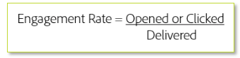

# 定位标准

发送新流量时，仅在IP预热的早期阶段定向参与度最高的用户。 这有助于在您接触较少参与的受众之前从一开始就建立良好的信誉以有效地建立信任。 以下是参与的基本公式：

通常，参与率基于特定时段。 根据公式是应用于整体级别，还是应用于特定邮件类型或营销活动，此量度可能会存在显着差异。 由于每个发件人和ISP各不相同，通常需要自定义计划，因此需要与您的Adobe可投放性顾问合作，来提供特定的定位标准。

## 产品特定资源

**Analytics**

* [如何提高参与率和留存率（教程）](https://experienceleague.adobe.com/docs/analytics-learn/tutorials/mobile-app-analytics/measuring-mobile-analytics/how-to-increase-engagement-and-retention-rates.html?lang=en#mobile-app-analytics)： *使用同类群组通过参与受众的行为识别参与受众，并了解让您的移动应用程序产生吸引力的根本原因。 使用区段IQ中的数据科学算法了解区段之间的区别和相似之处。*

**Campaign Standard**

* [AI支持的电子邮件：预测参与度评分](https://experienceleague.adobe.com/docs/campaign-standard/using/testing-and-sending/preparing-and-testing-messages/predictive.html#predictive-scoring)
